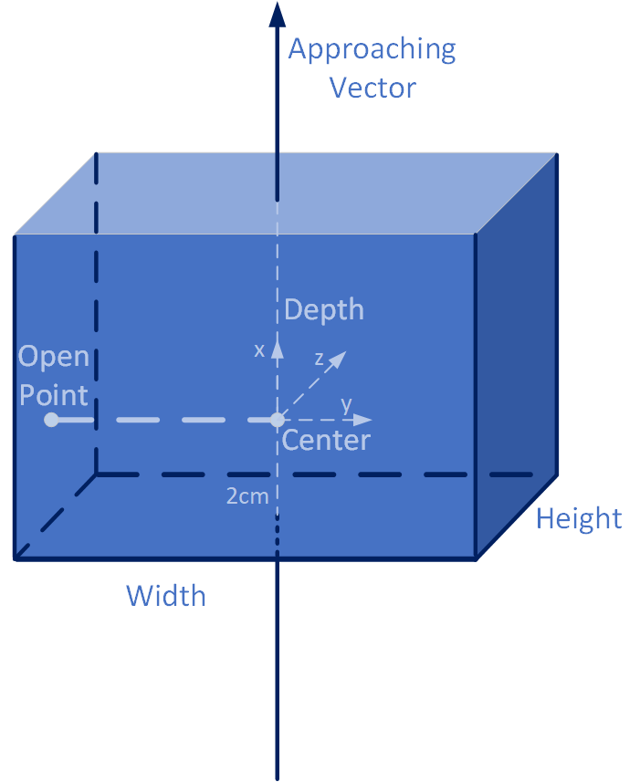

# graspnetAPI
[](https://badge.fury.io/py/graspnetAPI)

## Dataset

Visit the [GraspNet Website](http://graspnet.net) to get the dataset.

## Install
You can install using pip. (Note: The pip version might be old, install from the source is recommended.)
```bash
pip install graspnetAPI
```

You can also install from source.

```bash
git clone https://github.com/graspnet/graspnetAPI.git
cd graspnetAPI
pip install .
```

## Document

Refer to [online document](https://graspnetapi.readthedocs.io/en/latest/index.html) for more details.  
[PDF Document](https://graspnetapi.readthedocs.io/_/downloads/en/latest/pdf/) is available, too. 

You can also build the doc manually.
```bash
cd docs
pip install -r requirements.txt
bash build_doc.sh
```

LaTeX is required to build the pdf, but html can be built anyway.

## Grasp Definition
The frame of our gripper is defined as 
<div align="center">
    
</div>


## Examples
```bash
cd examples

# change the path of graspnet root

# How to load labels from graspnet.
python3 exam_loadGrasp.py

# How to convert between 6d and rectangle grasps.
python3 exam_convert.py

# Check the completeness of the data.
python3 exam_check_data.py

# you can also run other examples
```

Please refer to our document for more examples.

## Citation
Please cite these papers in your publications if it helps your research:
```
@article{fang2023robust,
  title={Robust grasping across diverse sensor qualities: The GraspNet-1Billion dataset},
  author={Fang, Hao-Shu and Gou, Minghao and Wang, Chenxi and Lu, Cewu},
  journal={The International Journal of Robotics Research},
  year={2023},
  publisher={SAGE Publications Sage UK: London, England}
}

@inproceedings{fang2020graspnet,
  title={GraspNet-1Billion: A Large-Scale Benchmark for General Object Grasping},
  author={Fang, Hao-Shu and Wang, Chenxi and Gou, Minghao and Lu, Cewu},
  booktitle={Proceedings of the IEEE/CVF Conference on Computer Vision and Pattern Recognition(CVPR)},
  pages={11444--11453},
  year={2020}
}
```

## Change Log

#### 1.2.6

- Add transformation for Grasp and GraspGroup.

#### 1.2.7

- Add inpainting for depth image.

#### 1.2.8

- Minor fix bug on loadScenePointCloud.
