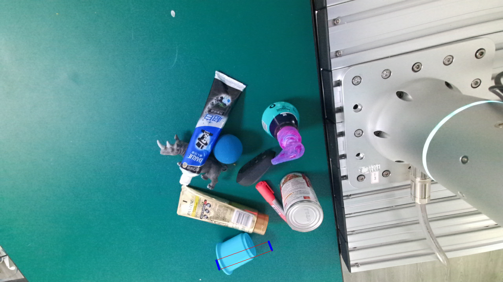
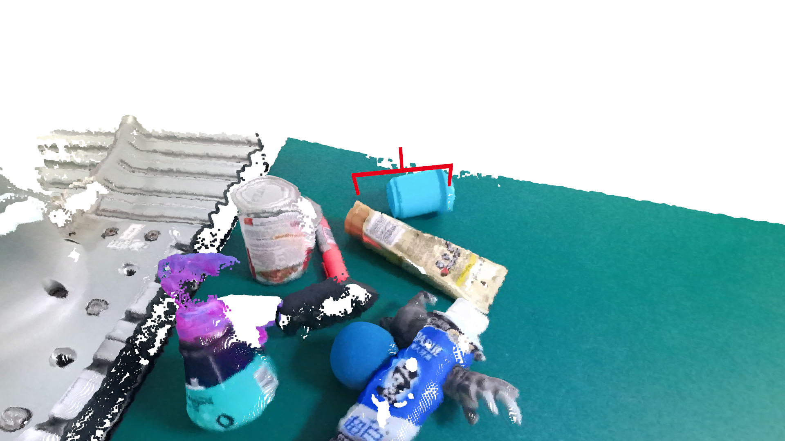
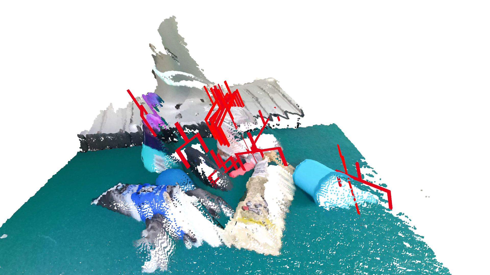
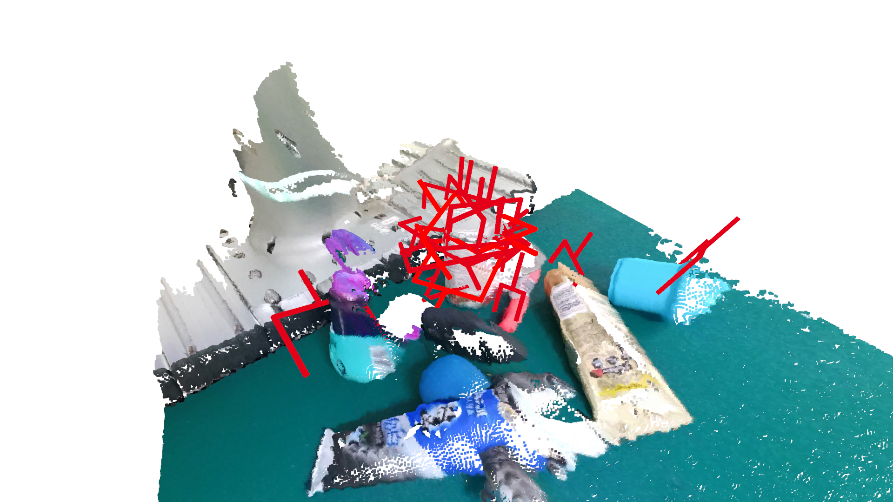
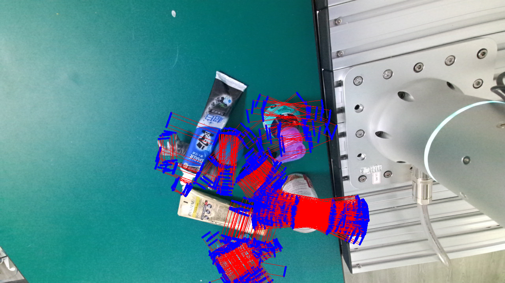

.. _example_vis:

Convert Labels between rectangle format and 6d format
=====================================================

Get a GraspNet instance.

.. literalinclude:: ../../examples/exam_convert.py
    :lines: 4-22

Convert rectangle format to 6d format
^^^^^^^^^^^^^^^^^^^^^^^^^^^^^^^^^^^^^

First, load rectangle labels from dataset.

.. literalinclude:: ../../examples/exam_convert.py
    :lines: 24-25

**Convert a single RectGrasp to Grasp.**

.. note:: This conversion may fail due to invalid depth information.

.. literalinclude:: ../../examples/exam_convert.py
    :lines: 27-42

Before Conversion:

After Conversion:

**Convert RectGraspGroup to GraspGroup.**

.. literalinclude:: ../../examples/exam_convert.py
    :lines: 44-56

Before Conversion:

.. image:: _static/convert_rect_before.png

After Conversion:

Convert 6d format to rectangle format
^^^^^^^^^^^^^^^^^^^^^^^^^^^^^^^^^^^^^

.. note:: Grasp to RectGrasp conversion is not applicable as only very few 6d grasp can be converted to rectangle grasp.

.. literalinclude:: ../../examples/exam_convert.py
    :lines: 58-

Before Conversion:

After Conversion:

