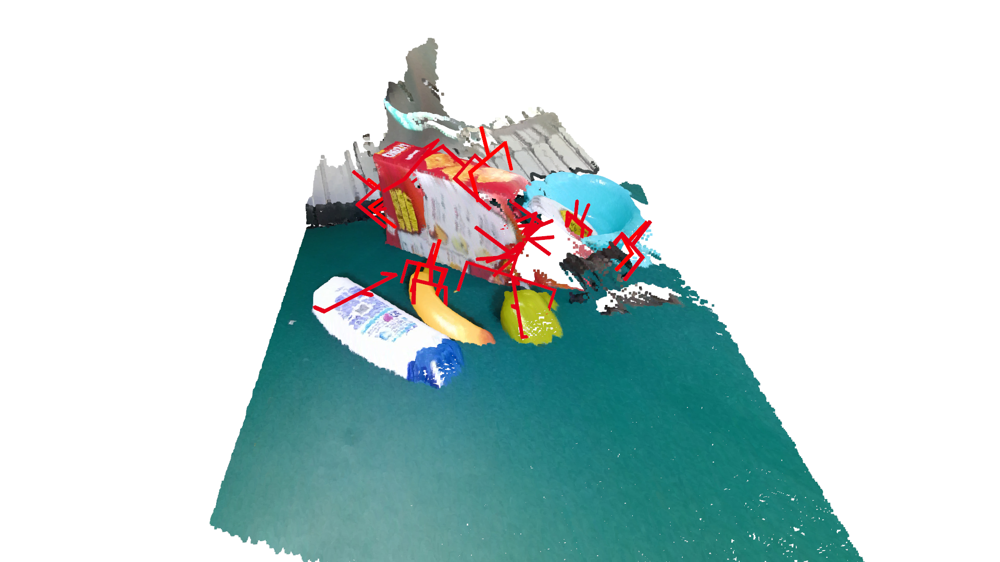
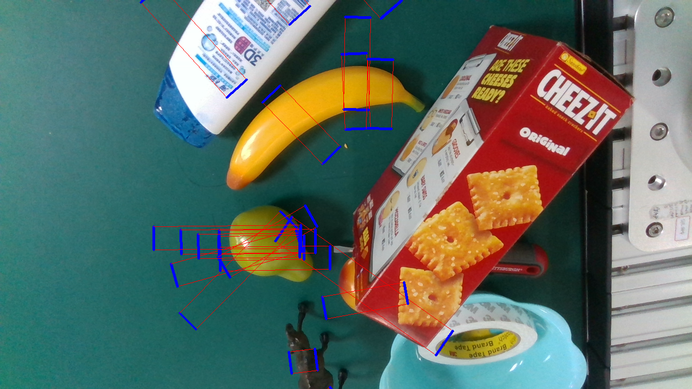

.. _example_loadGrasp:

Loading Grasp Labels
====================

Both `6d` and `rect` format labels can be loaded.

First, import relative libs.

.. literalinclude:: ../../examples/exam_loadGrasp.py
    :lines: 4-7

Then, get a GraspNet instance and setup parameters.

.. literalinclude:: ../../examples/exam_loadGrasp.py
    :lines: 11-19

Load GraspLabel in `6d` format and visulize the result.

.. literalinclude:: ../../examples/exam_loadGrasp.py
    :lines: 21-29

Load GraspLabel in `rect` format and visulize the result.

.. literalinclude:: ../../examples/exam_loadGrasp.py
    :lines: 31-40

