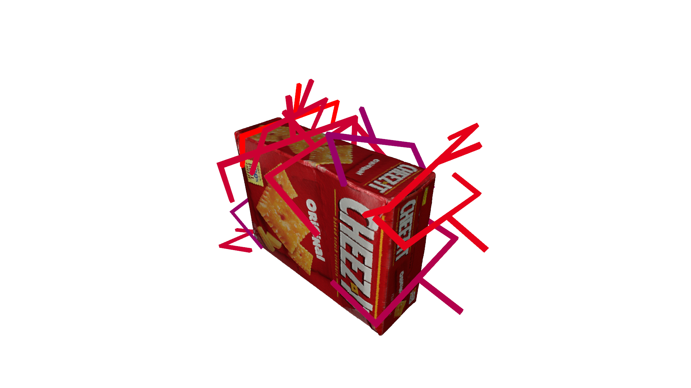
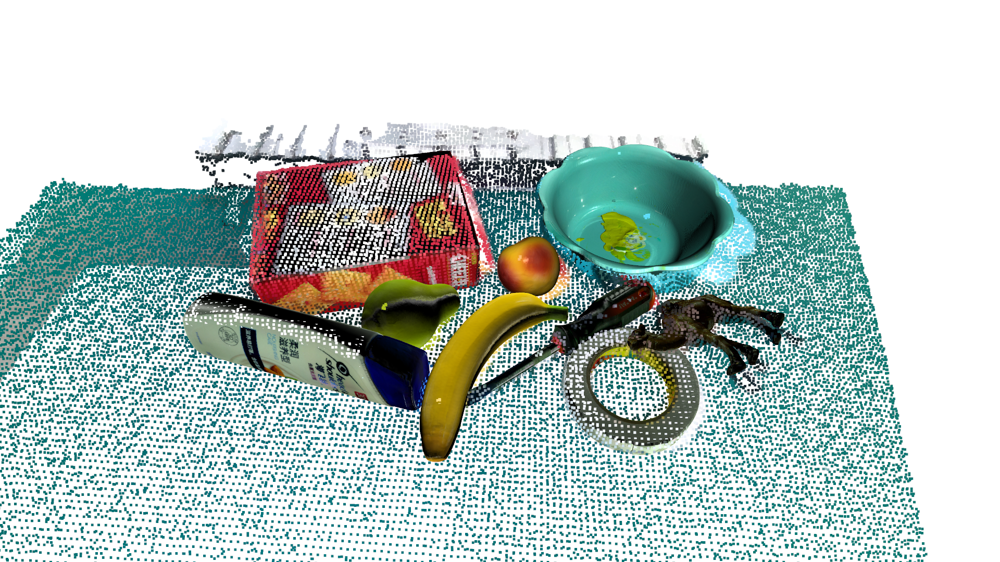
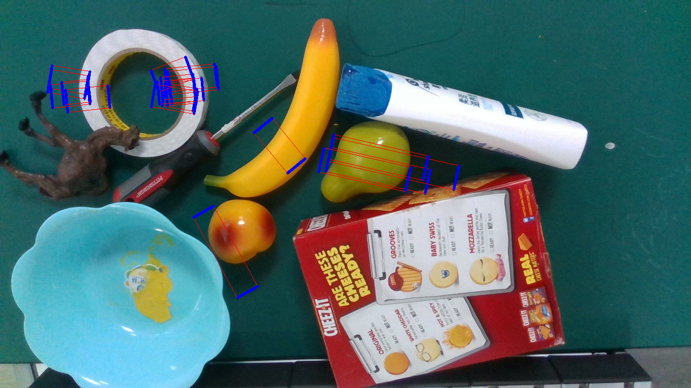
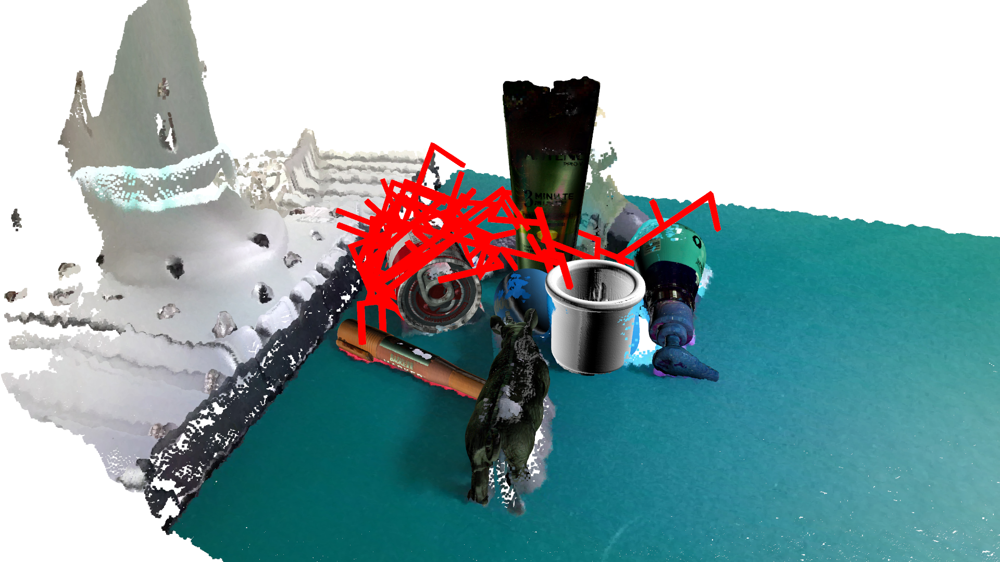

.. _example_vis:

Visualization of Dataset
========================

Get a GraspNet instance.

.. literalinclude:: ../../examples/exam_vis.py
    :lines: 7-14

Show grasp labels on a object.

.. literalinclude:: ../../examples/exam_vis.py
    :lines: 16-17

Show 6D poses of objects in a scene.

.. literalinclude:: ../../examples/exam_vis.py
    :lines: 19-20

Show Rectangle grasp labels in a scene.

.. literalinclude:: ../../examples/exam_vis.py
    :lines: 22-23

Show 6D grasp labels in a scene.

.. literalinclude:: ../../examples/exam_vis.py
    :lines: 25-26

