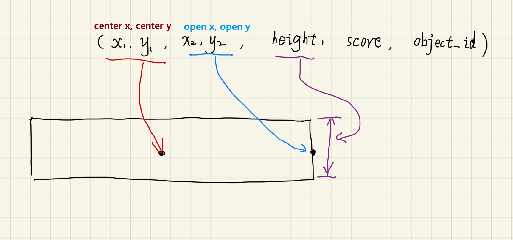
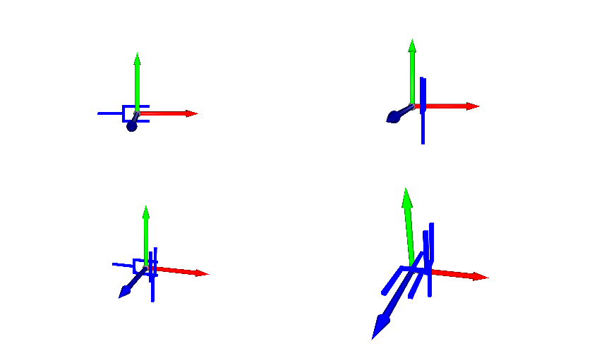

.. grasp_format:

Grasp Label Format
==================

Raw Label Format
----------------
The raw label is composed of two parts, i.e. labels for all grasp candidates on each object and collision masks for each scene.

Labels on Objects
^^^^^^^^^^^^^^^^^
The raw label on each object is a list of numpy arrays.

::

    >>> import numpy as np
    >>> l = np.load('000_labels.npz') # GRASPNET_ROOT/grasp_label/000_labels.npz
    >>> l.files
    ['points', 'offsets', 'collision', 'scores']
    >>> l['points'].shape
    (3459, 3)
    >>> l['offsets'].shape
    (3459, 300, 12, 4, 3)
    >>> l['collision'].shape
    (3459, 300, 12, 4)
    >>> l['collision'].dtype
    dtype('bool')
    >>> l['scores'].shape
    (3459, 300, 12, 4)
    >>> l['scores'][0][0][0][0]
    -1.0

- 'points' records the grasp center point coordinates in model frame.

- 'offsets' records the in-plane rotation, depth and width of the gripper respectively in the last dimension.

- 'collision' records the bool mask for if the grasp pose collides with the model.

- 'scores' records the minimum coefficient of friction between the gripper and object to achieve a stable grasp.

.. note::
    
    In the raw label, the **lower** score the grasp has, the **better** it is. However, -1.0 score means the grasp pose is totally not acceptable.

300, 12, 4 denote view id, in-plane rotation id and depth id respectively. The views are defined here in graspnetAPI/utils/utils.py.

.. literalinclude:: ../../graspnetAPI/utils/utils.py
    :lines: 51-58
    :linenos:

Collision Masks on Each Scene
^^^^^^^^^^^^^^^^^^^^^^^^^^^^^

Collision mask on each scene is a list of numpy arrays.

::

    >>> import numpy as np
    >>> c = np.load('collision_labels.npz') # GRASPNET_ROOT/collision_label/scene_0000/collision_labels.npz
    >>> c.files
    ['arr_0', 'arr_4', 'arr_5', 'arr_2', 'arr_3', 'arr_7', 'arr_1', 'arr_8', 'arr_6']
    >>> c['arr_0'].shape
    (487, 300, 12, 4)
    >>> c['arr_0'].dtype
    dtype('bool')
    >>> c['arr_0'][10][20][3]
    array([ True,  True,  True,  True])

'arr_i' is the collision mask for the `i` th object in the `object_id_list.txt` for each scene whose shape is (num_points, 300, 12, 4).
num_points, 300, 12, 4 denote the number of points in the object, view id, in-plane rotation id and depth id respectively.

Users can refer to :py:func:`graspnetAPI.GraspNet.loadGrasp` for more details of how to use the labels.

API Loaded Labels
-----------------

Dealing with the raw labels are time-consuming and need high familiarity with graspnet.
So the API also provides an easy access to the labels. 

By calling :py:func:`graspnetAPI.GraspNet.loadGrasp`, users can get all the positive grasp labels in a scene with their parameters and scores.

There are totally four kinds of data structures for loaded grasp labels: **Grasp**, **GraspGroup**, **RectGrasp** and **RectGraspGroup**.
The internal data format of each class is a numpy array which is more efficient than the Python list.
Their definitions are given in grasp.py

Example Labels
^^^^^^^^^^^^^^

Before looking into the details, an example is given below.

Loading a GraspGroup instance.

.. literalinclude:: ../../examples/exam_grasp_format.py
    :lines: 1-27

Users can access elements by index or slice.

.. literalinclude:: ../../examples/exam_grasp_format.py
    :lines: 29-35

Each element of GraspGroup is a Grasp instance.
The properties of Grasp can be accessed via provided methods.

.. literalinclude:: ../../examples/exam_grasp_format.py
    :lines: 37-46

RectGrasp is the class for rectangle grasps. The format is different from Grasp.
But the provided APIs are similar.

.. literalinclude:: ../../examples/exam_grasp_format.py
    :lines: 49-65

6D Grasp
^^^^^^^^
Actually, 17 float numbers are used to define a general 6d grasp.
The width, height, depth, score and attached object id are also part of the definition.

.. note::
    
    In the loaded label, the **higher** score the grasp has, the **better** it is which is different from raw labels. Actually, score = 1.1 - raw_score (which is the coefficient of friction)

.. literalinclude:: ../../graspnetAPI/graspnet.py
    :lines: 635-637
    :emphasize-lines: 2

The detailed defition of each parameter is shown in the figure.

.. image:: _static/grasp_definition.png

.. literalinclude:: ../../graspnetAPI/grasp.py
    :lines: 14-36

6D Grasp Group
^^^^^^^^^^^^^^

Usually, there are a lot of grasps in a scene, :py:class:`GraspGroup` is a class for these grasps.
Compared with :py:class:`Grasp`, :py:class:`GraspGroup` contains a 2D numpy array, the additional dimension is the index for each grasp.

.. literalinclude:: ../../graspnetAPI/grasp.py
    :lines: 201-218

Common operations on a list such as indexing, slicing and sorting are implemented. 
Besides, one important function is that users can **dump** a GraspGroup into a numpy file and **load** it in another program by calling :py:func:`GraspGroup.save_npy` and :py:func:`GraspGroup.from_npy`.

Rectangle Grasp
^^^^^^^^^^^^^^^
7 float numbers are used to define a general rectangle grasp, i.e. the center point, the open point, height, score and the attached object id.
The detailed definition of each parameter is shown in the figure above and below and the coordinates for center point and open point are in the pixel frame.

.. literalinclude:: ../../graspnetAPI/grasp.py
    :lines: 553-572

Rectangle Grasp Group
^^^^^^^^^^^^^^^^^^^^^

The format for :py:class:`RectGraspGroup` is similar to that of :py:class:`RectGrasp` and :py:class:`GraspGroup`.

.. literalinclude:: ../../graspnetAPI/grasp.py
    :lines: 752-769

.. note::

    We recommend users to access and modify the labels by provided functions although users can also manipulate the data directly but it is **Not Recommended**.
    Please refer to the Python API for more details.

Grasp and GraspGroup Transformation
-----------------------------------

Users can transform a Grasp or GraspGroup giving a 4x4 matrix.

.. literalinclude:: ../../examples/exam_grasp_format.py
    :lines: 67-95

